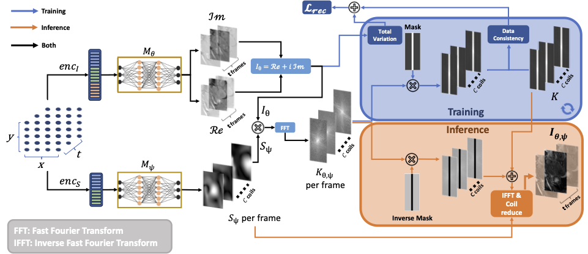
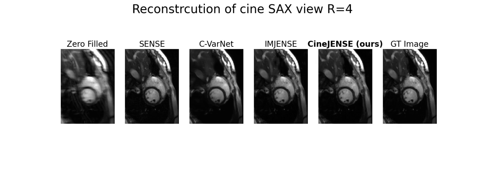
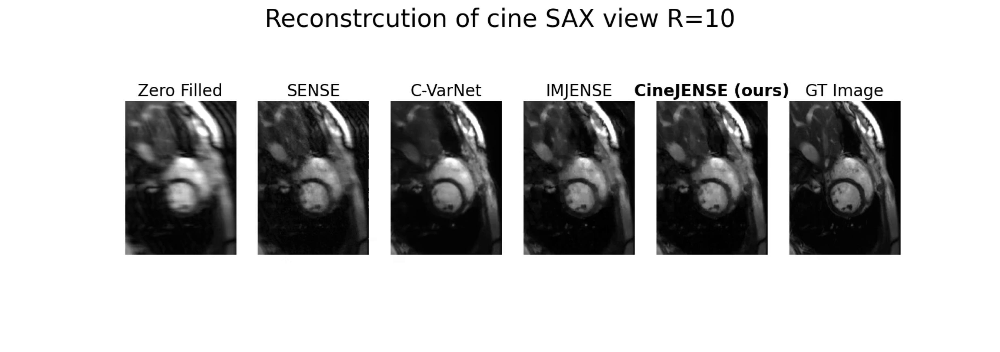

# CineJENSE - CMRxRecon 2023

This repository corresponds to the STATCOM submission "CineJENSE: Simultaneous Cine MRI Image Reconstruction and Sensitivity Map Estimation using Neural Representations" by Ziad Al-Haj Hemidi, Nora Vogt, Lucile Quilin, Christian Weihsbach, Mattias P. Heinrich, and Julien Oster.

## The CineJENSE Model



## Results






## Dependencies

This code is written in Python 3.7.4 and uses the following packages:

* pytorch
* numpy
* scipy
* h5py
* tiny-cuda-nn

See [pyproject.toml](pyproject.toml) for more details.

## Installation

To install the package, run the following command in the terminal:

```bash
git clone git@github.com:ziadhemidi/CineJense.git
cd CineJense
poetry lock && poetry install
```

You also have to install tinycudann. You can do it using the following command:

```bash
poetry run pip install git+https://github.com/NVlabs/tiny-cuda-nn/#subdirectory=bindings/torch
``````

You can find more instructions to tincudann [here](https://github.com/NVlabs/tiny-cuda-nn/tree/master).

## Usage

To run the code, you can use the following command:

```bash
poetry run python3.9 cinejense.py --input <input_file> --output <output_file> --dataset <dataset_name> --coil <coil_name> --task <task_name> 
```

where `<input_file>` is the path to the input file, `<output_file>` is the path to the output file, `<dataset_name>` is the name of the dataset, `<coil_name>` is the name of the coil and `<task_name>` is the name of the task.

For example, to run the code on the dataset `TestSet` with the coil `Multicoil` and the task `Cine`, you can use the following command:

```bash
poetry run python3.9 cinejense.py --input /input --output /output --dataset 'TestSet' --coil 'Multicoil' --task 'Cine
```

## License and Citation (Placeholder)

This code is licensed under the MIT license. If you use this code, please cite the following paper:

``` latex
@article{al2023cinejense,
  title={CineJENSE: Simultaneous Cine MRI Image Reconstruction and Sensitivity Map Estimation using Neural Representations},
  author={Al-Haj Hemidi, Ziad and Vogt, Nora and Quilin, Lucile and Weihsbach, Christian and Heinrich, Mattias P and Oster, Julien},
  journal={arXiv preprint arXiv:xxxxxxx},
  year={2023}
}   
```
